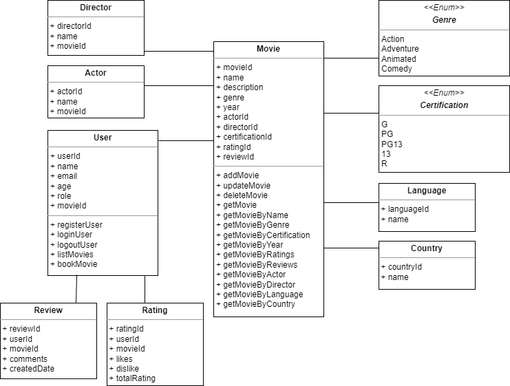

# Movie Recommendation API

## Introduction

This is the Movie recommendation API application which will give you the information about movie details based on our input using a Test-Driven Development approach.

### Pre-Requisites
- Java SE Development Kit 11
- Maven

### Technologies & Dependencies
- Spring Boot
- Spring Web
- MySQL Database (local), Amazon RDS MySQL (cloud)
- Lombok
- Spring Data JPA
- Actuator
- Swagger documentation
- Twilio Message service

### How to Get Started
- Fork this repo to your GitHub and then clone the forked version of this repo

### Main Entry Point
- The Main Entry Point for the application is: [MovieApplication.java](src/main/java/com/techreturners/moviemanager/MovieApplication.java)

### UML Diagram 

### Description
 Movie Recommendation API project is a Spring Boot application. We can Add/Update/Delete movies. Also, we can get details about a movie based on our API input and data availability. Implemented spring boot global exception handler. Applied Spring Boot "Actuator" module to monitor and manage application usage. Designed Swagger documentation
 
### The Recommended input for API to get a movie result :
- Id
- Genre
- Language
- Release year
- Ratings
- Certification
- Actor/Director name
- Country
 Also, we can get user's comments for the movie.
 
 ### Running the Unit Tests
- You can run the unit tests in IntelliJ/Eclipse, or you can go to your terminal and inside the root of this directory, run:

`mvn test`

Future Thoughts:
- Additional filter criteria based on userage
- We can adhere Spring Security concept to design role based API

